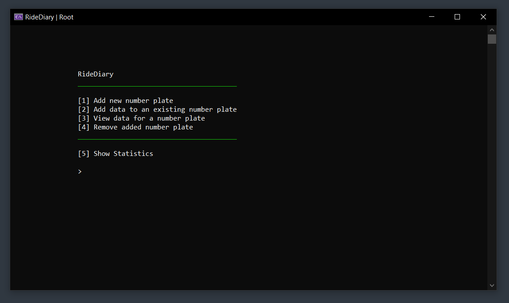
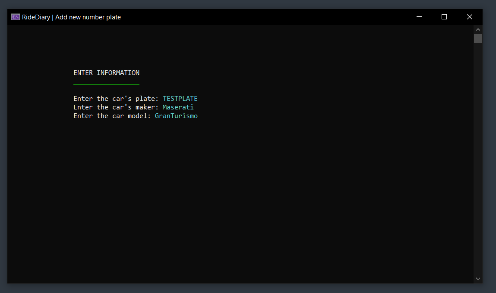
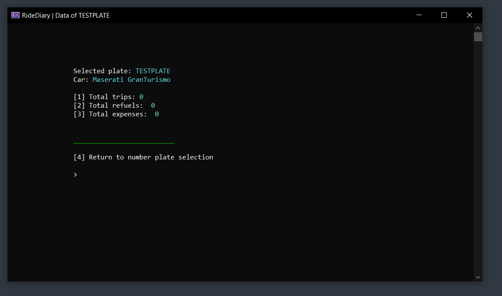
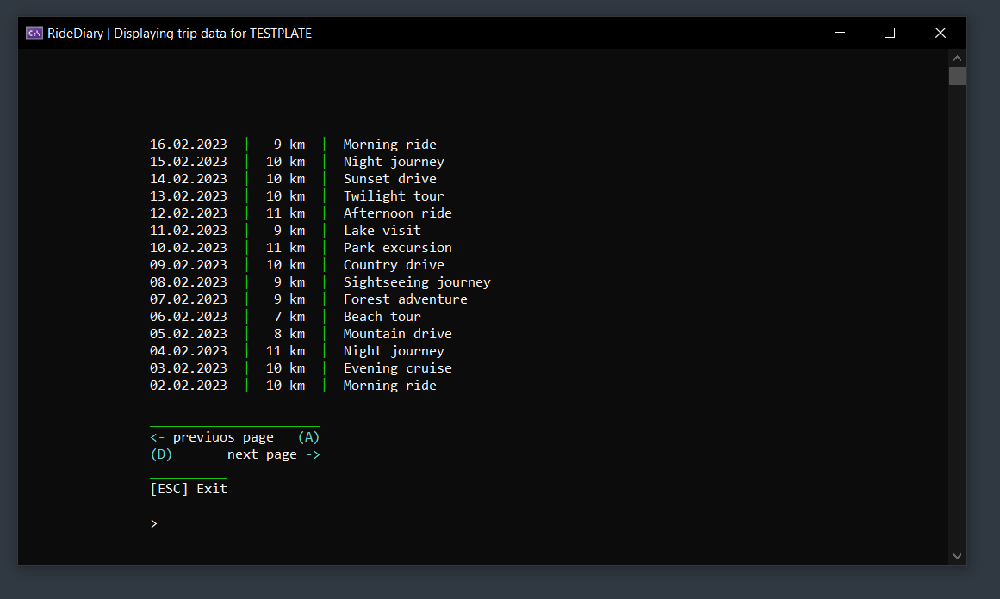

 

<h1 align="center">
  RideDiary
</h1>

---

 

This application serves as a database for storing car related data,
such as trips, expenses and so on. There is also the ability to display
statistics to get a better view on what kind of costs are related
to a car. It can be used for your private vehicles or even
for some company related vehicles.

As for the most projects that I created, a console application is a good
way to start, as it can be extended to syncing with a server. For now all data is only stored on
the local hard drive.

Currently (29th January 2024) the statistics feature is not implemented yet, but will add this
definetly later on : )

 

---

 

    
    
    
    

 

---

 

## Features

- Add different number plates with car maker/model.

- Add data to a number plate.
    > Expenses, Trips, Costs for refueling 

- View the data above for each number plate.

- Remove added number plates along with all saved information.

- Show statistics for a sinlge number plate or all together.

 

---

 

## Installation:

- Download the latest [release](https://github.com/mLoDar/RideDiary/releases/).

- The `RideDiary.exe` can be used directly.

### OR

- Download the latest [source code](https://github.com/mLoDar/RideDiary/releases/).

- For compiling the executable, you need to install [Visual Studio](https://visualstudio.microsoft.com/downloads/).

- Make sure that you install the `.NET desktop development`.

- Open the project from the downloaded `source code` with the `RideDiary.sln` file.